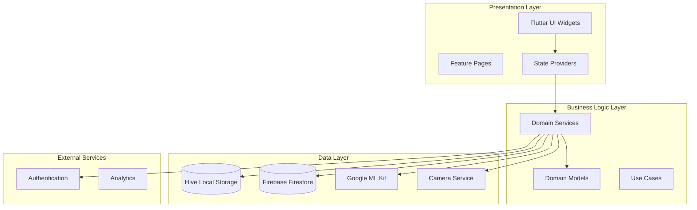

# Дизайн системы FitMonster

## Обзор

FitMonster представляет собой кроссплатформенное мобильное приложение, построенное на Flutter, которое интегрирует технологии машинного обучения для анализа физических упражнений с комплексной системой трекинга питания и мониторинга прогресса. Система использует архитектуру Clean Architecture с разделением на слои представления, бизнес-логики и данных.

## Архитектура

### Общая архитектура системы



### Модульная архитектура

Система организована по принципу feature-first с следующими основными модулями:

- **Core Module**: Общие сервисы, модели, утилиты
- **Auth Module**: Аутентификация и управление пользователями
- **Exercise Module**: Анализ упражнений и ML
- **Diet Module**: Трекинг питания и расчет калорий
- **Profile Module**: Профиль пользователя и статистика
- **Home Module**: Навигация и главный экран

## Компоненты и интерфейсы

### ML и анализ упражнений

#### PoseDetectionService
```dart
abstract class PoseDetectionService {
  Stream<PoseAnalysisResult> analyzePose(CameraImage image);
  Future<void> initialize();
  Future<void> dispose();
}
```

#### ExerciseAnalyzer
```dart
abstract class ExerciseAnalyzer {
  AnalysisResult analyzeExercise(Pose pose, ExerciseType type);
  bool isRepetitionComplete(List<Pose> poseHistory);
  List<String> detectMistakes(Pose pose, ExerciseType type);
}
```

#### RepCounter
```dart
abstract class RepCounter {
  int get currentCount;
  void processPose(Pose pose);
  void reset();
  Stream<int> get repStream;
}
```

### Диета и питание

#### DietService
```dart
abstract class DietService {
  Future<UserProfile> getUserProfile(String userId);
  Future<void> saveUserProfile(UserProfile profile);
  Future<List<FoodItem>> searchFood(String query);
  Future<void> addFoodLog(FoodLog log);
  Future<DailyNutrition> getDailyNutrition(String userId, DateTime date);
}
```

#### CalorieCalculator
```dart
abstract class CalorieCalculator {
  double calculateBMR(UserProfile profile);
  double calculateTDEE(double bmr, ActivityLevel activity);
  double calculateTargetCalories(double tdee, Goal goal);
  MacroNutrients calculateMacros(double calories);
}
```

#### AllergenSystem
```dart
abstract class AllergenSystem {
  List<String> checkAllergens(FoodItem food, List<String> userAllergies);
  bool isProductSafe(FoodItem food, UserProfile profile);
  List<FoodItem> getSafeAlternatives(FoodItem food, UserProfile profile);
}
```

### Статистика и прогресс

#### StatsService
```dart
abstract class StatsService {
  Future<UserStats> getUserStats(String userId);
  Future<void> updateWorkoutStreak(String userId);
  Future<void> addWeightEntry(String userId, double weight);
  Future<List<WeightEntry>> getWeightHistory(String userId);
  Future<void> updateCalorieStats(String userId, int calories);
}
```

### Хранение данных

#### StorageService
```dart
abstract class StorageService {
  Future<T?> get<T>(String key);
  Future<void> put<T>(String key, T value);
  Future<void> delete(String key);
  Future<void> clear();
}
```

#### SyncService
```dart
abstract class SyncService {
  Future<void> syncToCloud();
  Future<void> syncFromCloud();
  bool get isOnline;
  Stream<bool> get connectivityStream;
}
```

## Модели данных

### Основные модели

#### UserProfile
```dart
class UserProfile {
  final String userId;
  final int age;
  final double height;
  final double weight;
  final Gender gender;
  final ActivityLevel activityLevel;
  final Goal goal;
  final List<String> allergies;
  final List<String> contraindications;
  final DateTime createdAt;
  final DateTime updatedAt;
}
```

#### WorkoutSession
```dart
class WorkoutSession {
  final String id;
  final String userId;
  final String exerciseId;
  final String exerciseName;
  final DateTime startTime;
  final DateTime? endTime;
  final int targetReps;
  final List<RepData> repsData;
  final WorkoutStatus status;
  final int caloriesBurned;
  final List<String> mistakes;
}
```

#### FoodLog
```dart
class FoodLog {
  final String id;
  final String userId;
  final String foodId;
  final String foodName;
  final double quantity;
  final MealType mealType;
  final DateTime timestamp;
  final double calories;
  final MacroNutrients macros;
}
```

#### UserStats
```dart
class UserStats {
  final int workoutStreak;
  final int totalWorkouts;
  final double? currentWeight;
  final double? targetWeight;
  final int totalCalories;
  final DateTime lastWorkoutDate;
}
```

## Correctness Properties

*A property is a characteristic or behavior that should hold true across all valid executions of a system-essentially, a formal statement about what the system should do. Properties serve as the bridge between human-readable specifications and machine-verifiable correctness guarantees.*

### Property Reflection

После анализа всех критериев приемки, я выявил следующие области для объединения свойств:

**Объединенные свойства:**
- Свойства ML анализа (1.1-1.3, 7.1-7.5) можно объединить в комплексное свойство анализа упражнений
- Свойства аллергий (2.3, 5.4, 8.1-8.5) объединяются в систему безопасности питания
- Свойства офлайн-режима (4.1-4.5) объединяются в свойство устойчивости системы
- Свойства статистики (3.1-3.5) объединяются в свойство отслеживания прогресса

**Исключенные избыточные свойства:**
- Отдельные свойства для каждого типа упражнения заменены общим свойством анализа
- Дублирующиеся свойства сохранения данных объединены в общие свойства персистентности

### Основные свойства корректности

**Property 1: ML Exercise Analysis Correctness**
*For any* exercise session with valid pose data, the ML analysis system should correctly identify exercise type, count repetitions accurately, and provide appropriate feedback based on technique quality
**Validates: Requirements 1.1, 1.2, 1.3, 1.4, 7.1, 7.2, 7.3, 7.4, 7.5**

**Property 2: Calorie Calculation Consistency**
*For any* user profile with valid physical parameters, the calorie calculation should produce consistent results using the Mifflin-St Jeor formula and properly adjust for activity level and goals
**Validates: Requirements 2.1, 2.2, 5.3**

**Property 3: Allergen Safety System**
*For any* user with specified allergies or contraindications, the system should consistently warn about dangerous products, filter recommendations, and provide safe alternatives
**Validates: Requirements 2.3, 5.4, 8.1, 8.2, 8.3, 8.4, 8.5**

**Property 4: Progress Tracking Accuracy**
*For any* completed workout or nutrition entry, the progress tracking system should accurately update streaks, statistics, and historical data while maintaining data integrity
**Validates: Requirements 3.1, 3.2, 3.3, 3.4, 3.5**

**Property 5: Offline Mode Resilience**
*For any* system operation, the application should function completely offline, persist all changes locally, and synchronize correctly when connectivity is restored
**Validates: Requirements 4.1, 4.2, 4.3, 4.4, 4.5**

**Property 6: User Profile Management**
*For any* user account operation, the system should properly manage profile creation, authentication, data restoration, and secure logout with complete data cleanup
**Validates: Requirements 5.1, 5.2, 5.5**

**Property 7: Exercise Catalog Functionality**
*For any* exercise catalog interaction, the system should display complete exercise information, enable effective search and filtering, and properly integrate exercises into workout sessions
**Validates: Requirements 6.1, 6.2, 6.3, 6.4, 6.5**

**Property 8: Nutrition Progress Tracking**
*For any* daily nutrition tracking, the system should accurately calculate progress toward calorie and macro goals, provide appropriate warnings for overages, and maintain accurate daily summaries
**Validates: Requirements 2.4, 2.5**

**Property 9: Workout Session Persistence**
*For any* workout session, all session data including repetitions, technique scores, and mistakes should be reliably saved to local storage and available for historical review
**Validates: Requirements 1.5**

## Обработка ошибок

### Стратегия обработки ошибок

1. **ML и камера**:
   - Graceful degradation при недоступности ML Kit
   - Fallback на базовый подсчет повторений
   - Обработка ошибок камеры с пользовательскими уведомлениями

2. **Сетевые операции**:
   - Автоматические повторы с экспоненциальной задержкой
   - Кэширование для офлайн-режима
   - Пользовательские уведомления о статусе синхронизации

3. **Данные**:
   - Валидация входных данных
   - Резервное копирование критических данных
   - Восстановление после сбоев

### Типы ошибок

```dart
abstract class FitMonsterException implements Exception {
  final String message;
  final String code;
  const FitMonsterException(this.message, this.code);
}

class MLAnalysisException extends FitMonsterException {
  const MLAnalysisException(String message) : super(message, 'ML_ERROR');
}

class DataSyncException extends FitMonsterException {
  const DataSyncException(String message) : super(message, 'SYNC_ERROR');
}

class ValidationException extends FitMonsterException {
  const ValidationException(String message) : super(message, 'VALIDATION_ERROR');
}
```

## Стратегия тестирования

### Dual Testing Approach

Система использует комбинированный подход к тестированию:

**Unit Tests:**
- Тестируют конкретные примеры и граничные случаи
- Проверяют интеграционные точки между компонентами
- Фокусируются на специфических сценариях использования

**Property-Based Tests:**
- Проверяют универсальные свойства на множестве входных данных
- Используют библиотеку **test** для Dart с генераторами случайных данных
- Каждый тест выполняется минимум 100 итераций
- Каждое свойство реализуется одним property-based тестом

### Property-Based Testing Requirements

- **Библиотека**: Dart `test` package с custom generators
- **Минимальные итерации**: 100 на каждое свойство
- **Формат тегов**: `**Feature: fitmonster-prd, Property {number}: {property_text}**`
- **Покрытие**: Каждое correctness property должно иметь соответствующий PBT тест

### Тестовые генераторы

```dart
// Генератор пользовательских профилей
Generator<UserProfile> userProfileGenerator();

// Генератор данных позы для ML тестов
Generator<Pose> poseDataGenerator();

// Генератор продуктов питания
Generator<FoodItem> foodItemGenerator();

// Генератор сессий тренировок
Generator<WorkoutSession> workoutSessionGenerator();
```

### Интеграционные тесты

- Тестирование полных пользовательских сценариев
- Проверка взаимодействия между модулями
- Тестирование офлайн/онлайн переходов
- Проверка производительности ML анализа

### Тестирование производительности

- ML анализ: < 200мс на кадр
- UI отклик: < 1 секунда
- Синхронизация данных: < 5 секунд
- Запуск приложения: < 3 секунды

Эта стратегия тестирования обеспечивает высокое качество кода через сочетание конкретных unit тестов и универсальных property-based тестов, гарантируя корректность системы на всех уровнях.